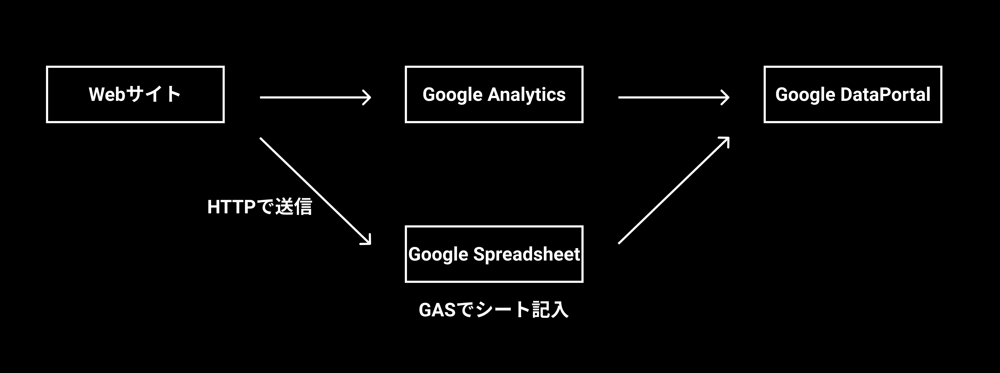
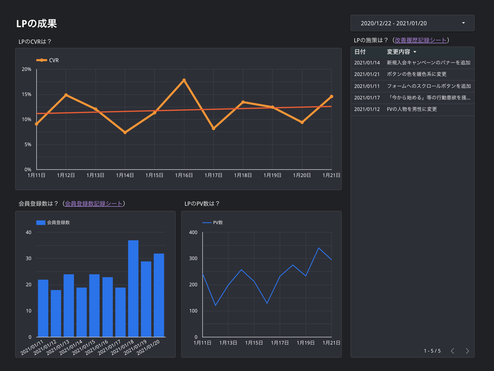

# Webサイト・WebサービスのKPIをリアルタイムで可視化するレポートの作成

## 概要

Webサービスのグロースハックを行う上で、指標をチーム全員が常に確認できる状況を作ることを最優先事項と考えて、Googleデータポータルを使って可視化しました。基本的にGoogle Analyticsから情報を抽出して、コンバージョン率・LPのPV数・主要ページからLPへの遷移率・バナーのクリック率等をグラフで表示できるようにしました。サービス内部のDBにアクセスする必要がある情報を表示するために、サービスから毎日スプレッドシートのGASアプリケーションに対してHTTP通信で情報を送信する系統も用意しました。毎日始業時にそのレポートをチェックするだけでサービスの状況が正確に把握できるため、メンバーの認識の共通化や動機付けに大いに役立ちました。

（※架空のデータを元に作成したサンプルレポートです）

## 工夫点

### 1. 施策のリストを作成し、グラフの横に表示

グラフだけだと、グラフに変化があった場合の原因を知るために別の資料を参照する必要がありました。そこで、スプレッドシートで施策のリストを作成し、データポータルのレポート上で表形式で表示するようにしました。これにより、指標の変化の状況に加え、その変化の原因となる施策も同時に把握したり、どのくらいのペースでPDCAを回せているのかを直感的に把握できるようになりました。

### 2. 絶対数ではなく、率による可視化

CTAを改善するためにクリック数を追っていましたが、SNSの運用やSEO対策等でサイトへの流入が増えると、それに応じてCTAのクリック数も増えてしまい、CTA自体の成果を測りづらいという課題がありました。そこで、CTAのクリック数を配置ページのPV数で割り、クリック率を算出することにより解決しました。データポータル上で混合データを作成し、Google Analyticsのデータ2つを結合してフィールドを作成することにより、データポータルのみでこれを実現することができました。

### 3. Webサービスのバックエンドからの情報を受信するGASの開発環境の構築

Google Apps Scriptで、自社バックエンドからの情報を受信する処理を実装するにあたり、Claspを使ってローカルで開発できるようにしました。また、GAS上での複数ファイルの扱いには若干癖があるため、Webpackを使って1ファイルに圧縮するようにしました。システムの開発を効率化するため、TypeScriptで開発しました。
