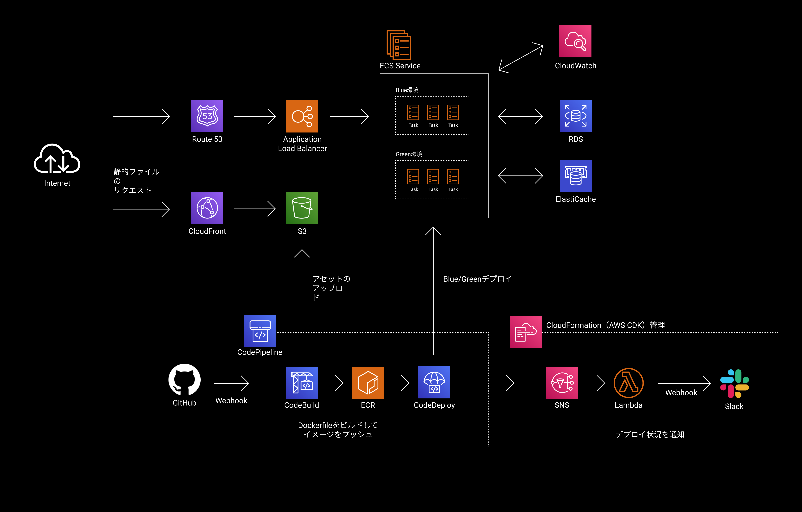

# AWS上でのRuby on Railsアプリケーションの本番環境の構築

## 概要

Ruby on Rails 5製のWebアプリケーションの本番環境としてAWSをセットアップしました。開発にはDockerを利用しており、AWS上ではAWS Fargateを利用してコンテナを実行していました。GitHubへのプッシュをトリガーにして、DockerイメージのビルドとAWS FargateのクラスターへのBlue / Greenデプロイを行うパイプラインも構築しましたAmazon EC2上に構築したRuby on Rails実行環境から、このAWS Fargateベースの環境への移行作業も行いました。
コンテナから出力されるログをCloudWatch Logsで調査したり、サービス間の通信をAWS X-Rayで可視化してボトルネックを探したり、負荷に応じてコンテナ数を調整したりする運用も経験しました。

## アーキテクチャー

- 環境変数はRailsのEncrypted Secrets機能を使って暗号化し、Gitリポジトリに含めています。
- Gitリポジトリ中の暗号化された環境変数を復号化するキー等は、Systems Managerのパラメーターストアに格納しています。

## 主要課題とその解決方法

### 1. DockerイメージのビルドからFargateサービスへのBlue/Greenデプロイを自動化するパイプラインの構築

FargateへのBlue/Greenデプロイを行うためのCodePipelineの設定は複雑で、正しく設定できていない場合のエラー表示も内容が伝わらない表現のものが多くありました。丁寧に構成を見直しつつ試行錯誤を繰り返すことで目的の動作をするインフラを構築することができましたが、CodeBuild上でのDockerイメージのビルドに時間がかかり試行1回あたりの所要時間が長いため、基本的に集中力との闘いとなりました。

### 2. インフラの構築の属人化

CloudFormationは、当時FargateへのBlue/Greenデプロイを行うCodeDeployデプロイメントグループの作成に対応していなかったため、マネジメントコンソールから手作業で環境を構築しました。ステージング環境との差分が出やすく、また調整もしづらいという難点がありました。そのため、最終的には以下の3つの要素に分けてインフラを構築する体制を設計しました。

1. VPCやECSクラスター等のアプリケーションに直接関係あるリソースを構築するスタック（AWS CDK管理）
2. RDSやCodeDeployのデプロイメントグループを構築するシェルスクリプト（AWS CLI利用）
3. 既存のリソースを取り込みつつ、デプロイパイプラインを構築するスタック（AWS CDK管理）

AWS CDKで既存のリソースをスタックに読み込むことができる `fromXXXArn` メソッドを活用しました。

これらの設計により、ステージング環境と本番環境を差分なく、スピーディにデプロイできるようになりました。

### 3. データベースのマイグレーションを行う場所

Ruby on Railsのマイグレーションコマンド（ `rails db:migrate` ）を実行する場所に困りました。CodeBuild上でDockerイメージをビルドして、すぐそれを利用してコマンドを実行しようと考えましたが、CodeBuildはVPCの外側で起動するため、DBにアクセスできないという課題がありました。2017年にVPC内部でCodeBuildを起動できる機能がリリースされましたが、今度はCodeBuildコンテナにはパブリックIPが付与されないため、NATゲートウェイを用意する必要に迫られました。NATゲートウェイを常時起動するのは、事業のフェーズ的にコストが高いと判断したため見送り、CodeBuildからECSに対して、AWS CLIを使って `run-task` してマイグレーションを実行する方式に着地させました。

### 4. Rails Consoleの利用環境構築

ちょっとした作業を行うのにRails Consoleはとても便利です。Fargate環境でもRails Consoleを利用したいと考えたので、DockerイメージにSystems Managerのエージェントをインストールして、Systems Managerのセッションマネージャーで接続できる環境を構築しました。セッションマネージャーで接続するためには、ハイブリッドアクティベーションを行う必要があるため、AWS CLIのスクリプトを作成してRails Console起動を1コマンドで行えるように効率化しました。
