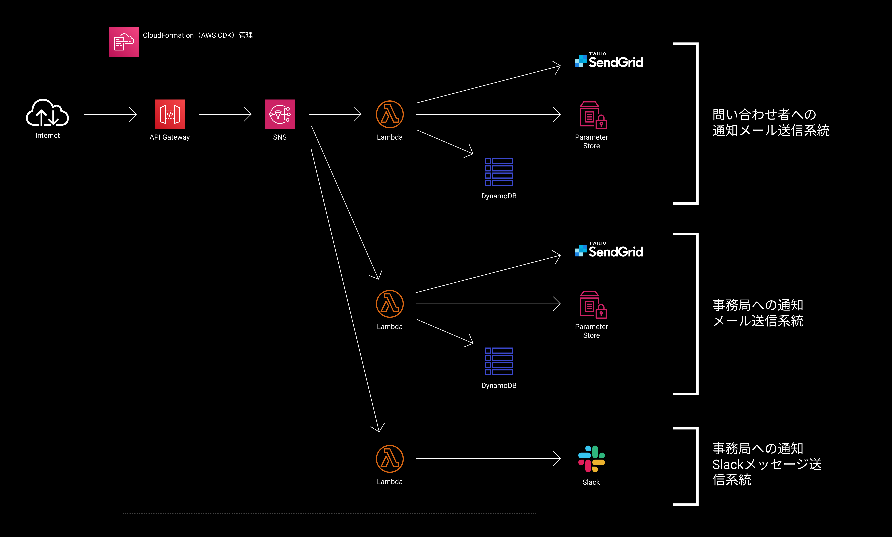

# 問い合わせフォームからの送信を受け付けるサーバーレスバックエンドの構築

## 概要

WordPress上の問い合わせフォームをよりリッチなUI/UXにすべく、Contact Form 7プラグインを利用した実装から、Vue.jsを利用した実装に移行しました。それに伴って、フォームからの送信情報を処理するシステムを自前で構築する必要に迫られました。WordPressにPHPで実装する方法も考えましたが、スケーラビリティとシステムを細かい単位に分割してテストしやすさを確保することを目的として、AWSのマネージドサービスを組み合わせてサーバーレスで構築する方針を取りました。

## アーキテクチャー

## 主要課題とその解決方法

### 1. 複数の処理を行うための実装方法の検討

問い合わせを受け付けるバックエンドという役割上、問い合わせ者への自動返信や本部への通知、利便性のためのSlackへの通知等の複数の処理を行わせる必要がありました。また、今後CRM等を導入した場合、そちらへのWebhook処理を追加する可能性も想定していました。処理の数や実行時間に応じて、フォームへのレスポンスが遅れることを避けたかったのと、処理を追加・削除する度に既存の処理のテストを念入りにし直すコストが気になったことから、API Gatewayの後ろに直接Lambdaを接続するのではなくSNSを噛ませる設計を取りました。

### 2. スタックのソースコード管理

比較的シンプルなサーバーレスシステムですが、手作業で構築するとそれなりに時間がかかりますし、ステージング環境を用意するとなると少なくとも2回同じ操作をする必要が出てきてしまいます。また、設定を調整するにしても変更履歴をドキュメントで管理するのは工数がかかると考えていたので、開発当初からIaCを見据えていました。使い慣れているAWS CDKを使ってCloudFormationを利用し、インフラのコード管理を実現しました。

### 3. エラーハンドリング

Lambdaの実行に失敗した場合は、Lambdaのリトライ戦略に基づいてリトライされます。また、CloudWatch Logsに出力されるログに対してフィルタとアラートを設定することで、エラー発生時に気付ける体制も構築しました。

### 4. フォーム上からPOSTしたくない情報の格納方法の検討

フォーム上から受け取った内容を信頼できない情報については、DynamoDB上に保存しておき、フォームから受け取った情報を元に必要な情報を抽出する設計としました。
